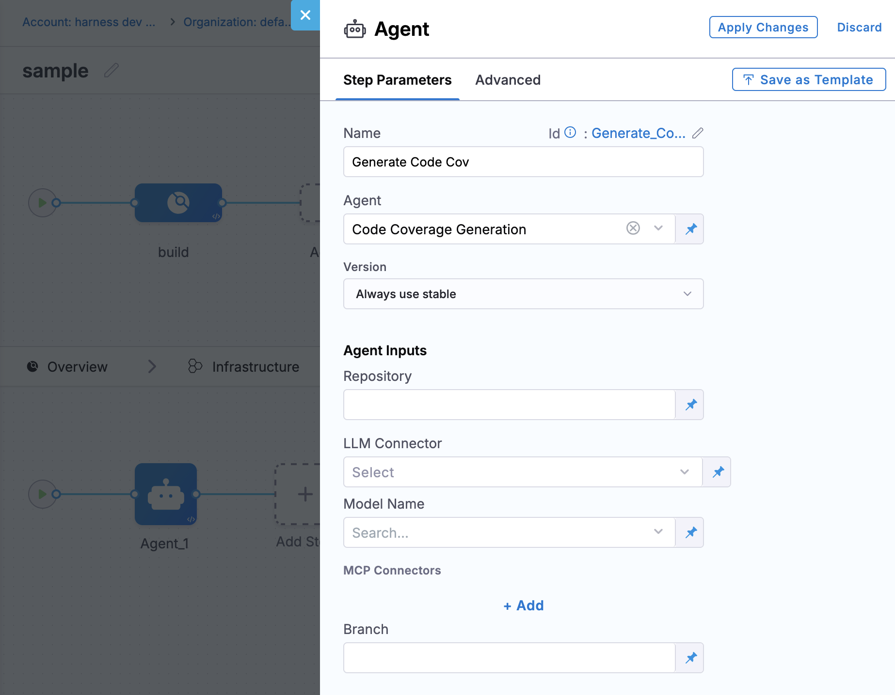

# Harness Custom AI Agents

This repository demonstrates how to build and use custom AI worker agents in Harness pipelines. Each agent is a Docker container that accepts pipeline context, reasons over it with an LLM, and writes structured output back into the pipeline.

**Contents**

- ❓[What is a Harness Custom AI Agents](#what-is-a-harness-custom-ai-agent)
- [This Repo's Structure](#repository-structure)
- [Prerequisites](#prerequisites)
- [Creating Your Own Agent](#creating-your-own-agent)
- [Examples](#examples)

## What is a Harness Custom AI Agent?

A custom AI agent is a reusable, versioned AI worker that runs as a native step in any Harness pipeline stage. It has three parts:

1. **Instructions** — a Markdown file that serves as the agent's system prompt. It defines the agent's role, references the declared inputs by name, and specifies the expected output format.
2. **Inputs** — named, typed parameters declared on the agent definition. Inputs are the contract between the agent and the pipelines that use it. Each pipeline step that invokes the agent supplies values for those inputs — from hardcoded strings, pipeline variables, or the output of earlier steps.
3. **Agent definition** — registered in Harness with a name, version, LLM connector, inputs schema, and instructions. Once registered, the agent is available to any pipeline in your account.

Agents are invoked using the **Agent** step type. The step references the agent by name and version, specifies the LLM connector to use, and supplies values for each declared input. Downstream steps reference the agent's output using standard Harness expressions.

```yaml
- step:
    name: My AI Agent
    identifier: My_AI_Agent
    type: Agent
    spec:
      agentId: my-custom-agent
      agentVersion: 1.0.0
      connectorRef: my_llm_connector
      inputs:
        repo: <+pipeline.variables.repoName>
        branch: <+codebase.branch>
        coverage_report: <+execution.steps.Run_Tests.output.outputVariables.COVERAGE>
```



## Repository Structure

```
.
├── README.md                        # This file
├── agent-instructions/              # Standalone instruction Markdown files (agent system prompts)
│   ├── ci-build-analyzer.md
│   ├── cd-deployment-advisor.md
│   ├── iac-reviewer.md
│   └── sto-security-triage.md
└── examples/                        # Complete, runnable examples per Harness module
    ├── ci-build-analyzer/           # CI: analyzes build/test failures
    │   ├── pipeline.yaml
    │   └── agent/
    │       ├── main.py
    │       ├── requirements.txt
    │       └── Dockerfile
    ├── cd-deployment-advisor/       # CD: reviews deployment config before rollout
    │   ├── pipeline.yaml
    │   └── agent/
    │       ├── main.py
    │       ├── requirements.txt
    │       └── Dockerfile
    ├── iac-reviewer/                # IaC: reviews Terraform plan for risk and drift
    │   ├── pipeline.yaml
    │   └── agent/
    │       ├── main.py
    │       ├── requirements.txt
    │       └── Dockerfile
    └── sto-security-triage/         # STO: triages vulnerability scan results
        ├── pipeline.yaml
        └── agent/
            ├── main.py
            ├── requirements.txt
            └── Dockerfile
```

## Prerequisites

- A Harness account with AI Agents enabled
- An LLM connector configured in Harness (Anthropic, OpenAI, or another supported provider)
- At least one Harness Cloud or Kubernetes build infrastructure for the pipeline stages that surround the agent step

## Creating Your Own Agent

### 1. Define agent inputs

Inputs are the named parameters your agent needs to do its job. Think of them as the agent's function signature — declaring them explicitly makes the agent self-documenting and allows any pipeline to supply the right context at invocation time.

For example, a code coverage agent might declare:

| Input | Type | Description |
|-------|------|-------------|
| `repo` | String | Repository name (e.g. `my-org/my-app`) |
| `branch` | String | Branch being evaluated |
| `coverage_report` | String | Raw coverage output from the test runner |
| `threshold` | Number | Minimum acceptable coverage percentage |

A CI build analyzer might declare `build_logs`, `test_results`, and `changed_files`. A deployment advisor might declare `manifest`, `environment`, and `change_summary`. Inputs should be as specific as possible — an agent that receives a targeted `coverage_report` string will produce better results than one that receives a wall of undifferentiated pipeline logs.

Inputs are declared in the agent definition (see step 2) and referenced by name inside the instructions.

### 2. Write the agent instructions

Create a Markdown file that describes what the agent does, references the declared inputs by name, and specifies the output format. This file becomes the LLM system prompt, so be specific.

```markdown
# My Custom Agent

## Role
You are a <describe role>.

## Inputs
The following values are provided by the pipeline:
- `repo`: the repository being analyzed (e.g. `my-org/my-app`)
- `branch`: the branch under review
- `coverage_report`: raw output from the test coverage tool
- `threshold`: minimum acceptable coverage percentage (numeric)

## Output Format
Respond only with a JSON object:
\`\`\`json
{
  "summary": "one-line finding",
  "severity": "low | medium | high | critical",
  "recommendations": ["..."]
}
\`\`\`
```

See [`agent-instructions/`](agent-instructions/) for real examples.

### 3. Register the agent in Harness

In the Harness UI, navigate to **Account Settings → AI Agents → New Agent**. Provide:

- **Name** and **ID** — used to reference the agent in pipelines
- **Version** — semantic version (e.g., `1.0.0`)
- **Inputs** — declare each input with a name, type, and description
- **Instructions** — paste the contents of your Markdown file, or point to the file in your repo
- **LLM Connector** — select the Harness connector for your LLM provider (Anthropic, OpenAI, etc.)

You can also define agents via the Harness API or YAML:

```yaml
agent:
  name: My Custom Agent
  identifier: my_custom_agent
  version: 1.0.0
  llmConnectorRef: my_llm_connector
  inputs:
    - name: repo
      type: String
      description: Repository name (e.g. my-org/my-app)
    - name: branch
      type: String
      description: Branch being evaluated
    - name: coverage_report
      type: String
      description: Raw output from the test coverage tool
    - name: threshold
      type: Number
      description: Minimum acceptable coverage percentage
  instructions: |
    # My Custom Agent
    ...
```


### 4. Add an MCP Server (Optional)

Agents can additionally use an MCP server connector that contains the relevant tools and skills for interacting with another resource. For example, the Harness MCP server can be added to access Harness-native data (like pipelines, executions, services, ect.). 

> [!TIP]
> MCP servers are an optional resource. It's recommended to add the Harness hosted MCP server when accessing data from Harness or about a pipeline.

MCP servers are added as connectors. Like other connectors, these can live at the account, org, or project levels.

```yaml
connector:
  name: Harness MCP Server
  identifier: Harness_MCP_Server
  description: ""
  accountIdentifier: YOUR_ACCOUNT_ID
  orgIdentifier: YOUR_ORG_ID
  projectIdentifier: YOUR_PROJECT_ID
  type: Mcp
  spec:
    serverUrl: https://app.harness.io/prod1/mcp-server-external/mcp
    auth:
      type: CustomHeader
      spec:
        headerName: X-Api-Key
        headerValueRef: wm_known_good_token
    executeOnDelegate: false
```

> [!TIP]
> The MCP server URL for Harness depends on your account's cluster. See the list [here](https://developer.harness.io/docs/platform/harness-ai/harness-agents/#harness-hosted-mcp-endpoints).

> [!NOTE]
> MCP servers can be configured in the agent definition or be added when consuming the agent step in a pipeline. Using an MCP server is optional. 

### 5. Use the agent in a Harness pipeline

Reference the registered agent with the **Agent** step type. Supply values for each declared input — values can be hardcoded, pipeline variables, or expressions referencing earlier step outputs:

```yaml
- step:
    name: My AI Agent
    identifier: My_AI_Agent
    type: Agent
    spec:
      agentId: my_custom_agent
      agentVersion: 1.0.0
      connectorRef: my_llm_connector
      inputs:
        repo: <+pipeline.variables.repoName>
        branch: <+codebase.branch>
        coverage_report: <+execution.steps.Run_Tests.output.outputVariables.COVERAGE>
        threshold: 80
```

Downstream steps can reference agent output with:
```
<+execution.steps.My_AI_Agent.output.outputVariables.AGENT_SUMMARY>
<+execution.steps.My_AI_Agent.output.outputVariables.AGENT_SEVERITY>
```

## Examples

| Example | Module | What it does |
|---------|--------|--------------|
| [ci-build-analyzer](examples/ci-build-analyzer/) | CI | Reads build logs and test results, identifies root causes, suggests fixes |
| [cd-deployment-advisor](examples/cd-deployment-advisor/) | CD | Evaluates a deployment manifest and change context before rollout |
| [iac-reviewer](examples/iac-reviewer/) | IaC Management | Reviews a Terraform plan, flags risky changes and policy violations |
| [sto-security-triage](examples/sto-security-triage/) | STO | Triages vulnerability scan output, prioritizes CVEs, drafts remediation notes |
